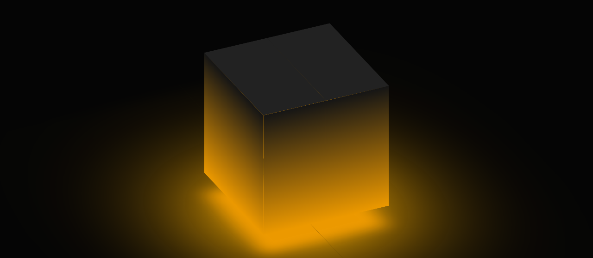

# Personal Project (CSS) - 3D Cube Animation

This is my Personal Project on creating a 3D Cube Animation 

## Table of contents

- [Overview](#overview)
  - [Screenshot](#screenshot)
  - [Links](#links)
- [My process](#my-process)
  - [Built with](#built-with)
  - [What I learned](#what-i-learned)
  - [Continued development](#continued-development)
  - [Useful resources](#useful-resources)
- [Author](#author)
- [Acknowledgments](#acknowledgments)

## Overview

### Screenshot



### Links

- Solution URL: [Github Repo](https://github.com/fritzadelbertus/PP02_3D-Cube-Animation)
- Live Site URL: [Github Page](https://fritzadelbertus.github.io/PP02_3D-Cube-Animation/)

## My process

### Built with

- Semantic HTML5 markup
- CSS custom properties
- CSS Animation and Transition
- CSS 3D Objects

### What I learned

I found a new property that is ```transform-style: preserve-3d```. I think it will be used alot when I create more 3D object in the future

I'm also proud of this inovation I use to create a hover effect on the cube
```css
.cube-box:hover > .cube div span  {
  transform: rotateY(calc(90deg * var(--i))) translateZ(250px);
}
.cube-box:hover > .cube .top {
  transform: rotateX(90deg) translateZ(250px);
}
```

### Continued development

I will try to create different 3D shape and add more content to the 3D object. My goal right now is to create interactive 3D object for my future websites.

### Useful resources

- [Ambient Light Effects | CSS 3D Glowing Cube Animation Effects](https://www.youtube.com/watch?v=nOdDtnHWaDo) - The tutorial for the basic 3D cube animation.


## Author

- Website - [Fritz Adelbertus Sitindaon](https://furitsu.site/)
- LinkedIn - [Fritz Adelbertus](https://www.linkedin.com/in/fritzadelbertus/)

## Acknowledgments

I want to say thank you to [Online Tutorials](https://www.youtube.com/c/OnlineTutorials4Designers) for providing this tutorial. It will really help me start creating 3D Objects on websites.
